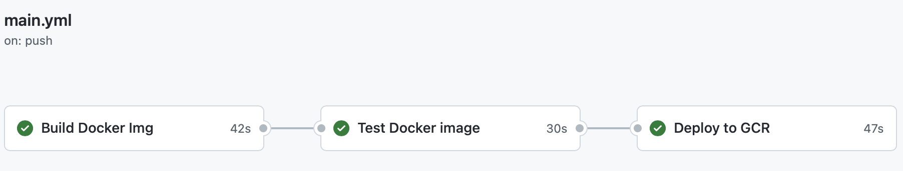
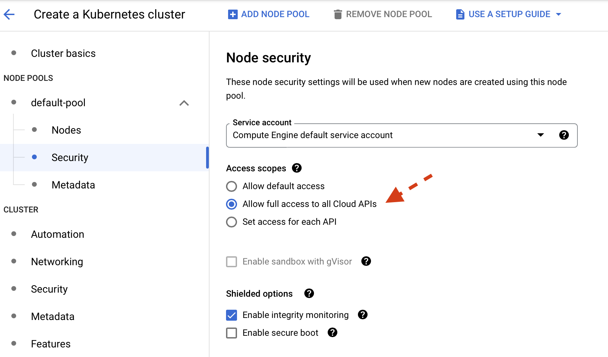

# Robots Kinematics


## Usage (Local development)

### Enable Google OAuth2, and use your Google ClientId and ClientSecret.  
Use provided ```.env.example``` and rename it to ```.env```.  
```docker-compose.yml``` picks up environmental variables in ```.env``` file by default.

```
# .env 
GOOGLE_CLIENT_ID=bring-your-own
GOOGLE_CLIENT_SECRET=bring-your-own
```

### Run dev environment
```shell
docker-compose up -d --build
```

### Run Postgresql client
```shell
docker-compose exec robots-db psql -U postgres
```

### Run pytest
```shell
docker-compose exec api python -m pytest 
```

### Code coverage & quality
- Code test coverage
```shell
docker-compose exec api python -m pytest --cov="."
```

- Linting
```shell
docker-compose exec api flake8 .
```

- Code formatting
```shell
docker-compose exec api black . --check
docker-compose exec api black . --diff
docker-compose exec api black .
```

- Sort imports alphabetically
```shell
docker-compose exec api isort . --check-only
docker-compose exec api isort . --diff
docker-compose exec api isort .
```

### Use Swagger with browser
Browse with the following url and click on ```OpenAPI```
```shell
http://localhost:8004
```


The following is screenshot of OpenAPI


Robot tracker is one of feature.  You can track a robot_id and its average location data.


## CICD pipeline

Three stages in CICD pipepline.
In the final stage, we deploy docker container to Google Container Registry and Google Artifact Registry with auto tagging.

Tagging follows standard versioning scheme.  

Version number is increased based on [major|minor|patch].

For example,  1.0.0 -> 2.0.0 for major,  1.0.0 -> 1.1.0 for minor,  1.0.0 -> 1.0.1 for patch.

You can modify the following in ```.github/workflows/main.yaml```.
```yaml
      - name: Automatic Tagging  of Releases
        working-directory:
          scripts
        id: increment-git-tag
        run: |-
          chmod +x ./git_update.sh
          bash ./git_update.sh -v minor  <-- change accordingly[major|minior|patch]
```





## Deployment

### Heroku

#### Heroku deployment is very simple and easy.  
- Create a new app
```shell
$ heroku create

Creating app... done, ⬢ morning-shore-15554
```
- Log in to Heroku Container Registry
```shell
$ heroku container:login                            

Login Succeeded 
```

- Provision a Postgres database (with free plan)
```shell
$ heroku addons:create heroku-postgresql:hobby-dev --app morning-shore-15554

Creating heroku-postgresql:hobby-dev on ⬢ morning-shore-15554... free
```

- Build prod image and tag following Heroku registry format
```shell
$ dockerbuild -f ../Dockerfile.prod -t registry.heroku.com/mmorning-shore-15554/web .

[+] Building 102.9s (15/15) FINISHED
```

- Push to Docker registry
```shell
$ docker push registry.heroku.com/morning-shore-15554/web:latest

The push refers to repository [registry.heroku.com/morning-shore-15554/web]
b84f418deff4: Pushed 
...
```

- Release the image
```shell
$ heroku container:release web --app morning-shore-15554
Releasing images web to morning-shore-15554... done
```

- Add environment variables.  Refer ***Google Client ID*** section below.
    ```
    CLIENT_ID=
    CLIENT_SECRET=
    ```
  **NOTE**: DATABASE_URL is automatically set by Heroku as we created Postgresql in Heroku.


### Google Client ID 
- Make sure add Authorized JavaScript origins and Authorized redirect URIs are updated accordingy.
- For ```Authorized redirect URIs```, add ```http://``` uri instead of ```https://``` if HTTPS is not enabled.


### GCP Cloud Run
You should have docker image in both Google Container Registry and Artifact Registry.  
Use the latest image to deploy in Cloud Run.  You still need to set up the following three environment variable in Cloud Run.
```
DATABASE_URL=
CLIENT_ID=
CLIENT_SECRET=
```


### GCP GKE via Helm Chart


As prerequisites, We need to set up CloudSQLProxy to access CloudSQL from pod(s).   

1. When you create GKE cluster, make sure allow CloudSQL API or allow all Cloud APIs in Access scopes.


    ```shell
    gcloud container clusters get-credentials [project-id] --zone=[zone]
    ```

2. Create service account for CloudSql proxy.
    ```shell
    gcloud iam service-accounts create cloudsqlproxy
    ```

3. Binding necessary permissions to access CloudSQL as a client.
    ```shell
    gcloud projects add-iam-policy-binding [project-id] \
    --member serviceAccount:cloudsqlproxy@[project-id].iam.gserviceaccount.com \
    --role roles/cloudsql.client
    ```

4. Create a key that service account can use for authentication and download it
    ```shell
    gcloud iam service-accounts keys create ./sqlproxy.json \
    --iam-account cloudsqlproxy@[project-id].iam.gserviceaccount.com
    ```

5. We want to create ```credentials.json``` 
    ```shell
    kubectl create secret generic cloudsql-instance-credentials \
    --from-file=credentials.json=./sqlproxy.json
    ```

    **Note**: Detail information is in [cloudsql-proxy github](https://github.com/GoogleCloudPlatform/cloudsql-proxy/tree/main/examples/k8s-sidecar#run-the-cloud-sql-proxy-as-a-sidecar)

6. Helm Chart requires to store sensitive environment variables stored in your local machine and encrypted in run-time.
    ```shell
    # store the followingn environment varialbes in local mahcine
    export DATABASE_URL=
    export CLIENT_ID=
    export CLIENT_SECRET=
    ```

7. Run the following to install.
    ```shell
    helm install --set database_url=$DATABASE_URL \
    --set client_id=$CLIENT_ID \
    --set client_secret=$CLIENT_SECRET \
    [chart-name] [chart-path]
    ```


## Todos

- [x] Protect private routes
- [ ] Pytest
- [x] Heroku deployment
- [x] GCP Cloud Run deployment
- [x] Create Helm Chart
- [x] GCP GKE deployment with CloudSQL


## Troubleshoot

I have struggled to get Poetry working on Python 3.10.x. I think the reason was I have installed Poetry with Python 3.9.x and upgraded to 3.10.x

Run the following in Python virtual environment if you run into a trouble to run ```poetry```.
```shell
pip install cleo tomlkit poetry.core requests cachecontrol cachy html5lib pkginfo virtualenv lockfile
```


