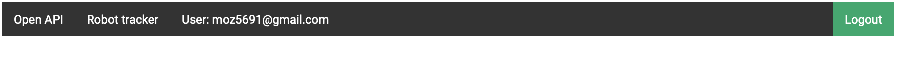
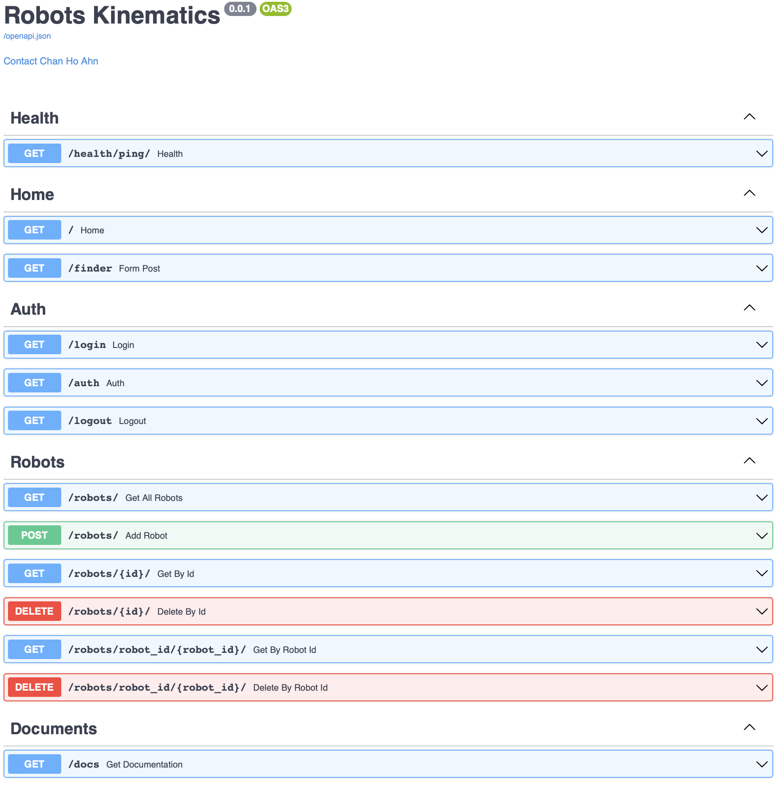
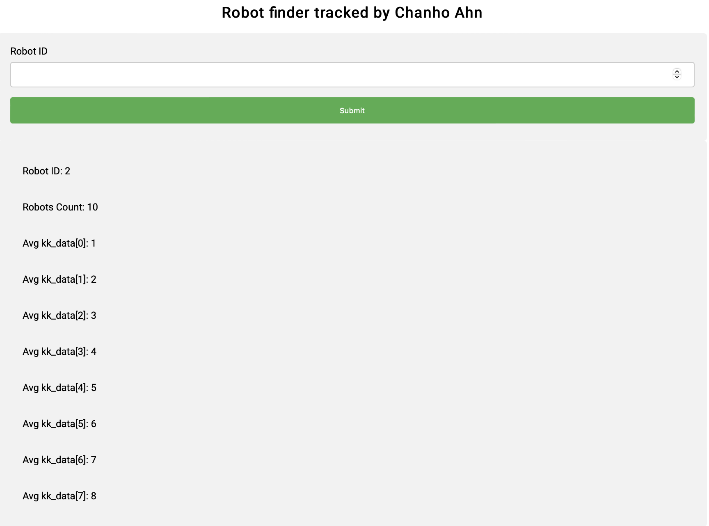
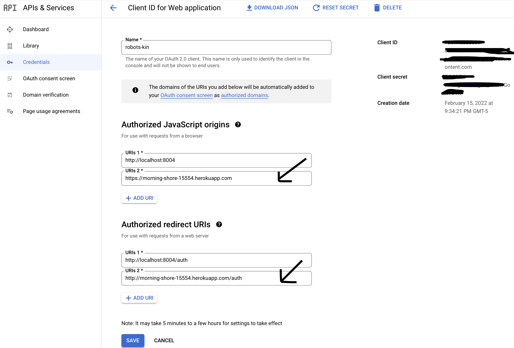

# Robots Kinematics


## Usage

### Enable Google OAuth2, and use your Google ClientId and ClientSecret.  
Update provided ```.env.example``` and rename it to ```.env```.  ```docker-compose.yml``` uses environmental variables in ```.env``` file.

```
# .env 
GOOGLE_CLIENT_ID=bring-your-own
GOOGLE_CLIENT_SECRET=bring-your-own
```

### Run dev environment
```shell
docker-compose up -d --build
```

### Run postgres client
```shell
docker-compose exec robots-db psql -U postgres
```

### Run pytest
```shell
docker-compose exec api python -m pytest 
```

### Code coverage & quality
- Code test coverage
```shell
docker-compose exec api python -m pytest --cov="."
```

- Linting
```shell
docker-compose exec api flake8 .
```

- Code formatting
```shell
docker-compose exec api black . --check
docker-compose exec api black . --diff
docker-compose exec api black .
```

- Sort imports alphabetically
```shell
docker-compose exec api isort . --check-only
docker-compose exec api isort . --diff
docker-compose exec api isort .
```

### Use Swagger with browser
Browse with the following url and click on ```OpenAPI```
```shell
http://localhost:8004
```


The following is screenshot of OpenAPI


Robot tracker is one of feature.  You can track a robot_id and its average location data.



## Deployment

### Heroku

- Create a new app
```shell
$ heroku create

Creating app... done, ⬢ morning-shore-15554
```
- Log in to Heroku Container Registry
```shell
$ heroku container:login                            

Login Succeeded 
```

- Provision a Postgres database (with free plan)
```shell
$ heroku addons:create heroku-postgresql:hobby-dev --app morning-shore-15554

Creating heroku-postgresql:hobby-dev on ⬢ morning-shore-15554... free
```

- Build prod image and tag following Heroku registry format
```shell
$ dockerbuild -f ../Dockerfile.prod -t registry.heroku.com/mmorning-shore-15554/web .

[+] Building 102.9s (15/15) FINISHED
```

- Push to Docker registry
```shell
$ docker push registry.heroku.com/morning-shore-15554/web:latest

The push refers to repository [registry.heroku.com/morning-shore-15554/web]
b84f418deff4: Pushed 
...
```

- Release the image
```shell
$ heroku container:release web --app morning-shore-15554

Releasing images web to morning-shore-15554... done

```

### Google Client ID 
- Make sure add Authorized JavaScript origins and Authorized redirect URIs are updated accordingy.
- For ```Authorized redirect URIs```, add ```http://``` uri instead of ```https://``` if HTTPS is not enabled.




### GCP Cloud Run


## Todos

- [ ] Protect private routes
- [ ] Pytest
- [x] Heroku deployment
- [ ] GCP Cloud Run deployment
- [ ] K8s set up
- [ ] Create Helm Chart
- [ ] GCP GKE deployment

## Troubleshoot

I have struggled to get Poetry working on Python 3.10.x. I think the reason was I have installed Poetry with Python 3.9.x and upgraded to 3.10.x

Run the following in Python virtual environment if you run into a trouble to run ```poetry```.
```shell
pip install cleo tomlkit poetry.core requests cachecontrol cachy html5lib pkginfo virtualenv lockfile
```


